# TheDonna - The Smart Office Assistant in mobile

## Introduction:
&nbsp;&nbsp;&nbsp;&nbsp;&nbsp;Being in a huge corporate world, we often get lost literally. Yeah, most of the tech giants own huge blocks of buildings and they operate in a seamless way, but being humans we often tend to remember all details of what is where in the real world. On a specific note, being at work which involves lots of floors, partitions, and wings, we often wind up moving across various parts of the mazes that we live across. With smart personal assistants, this can very well be addressed by making our workplace a lot easy to move and comfy to work.

Download the mobile application executable  [Here](https://github.com/rajagopal28/Donna/blob/master/statics/com.nativescript.donna.ai.apk)

The mobile variant of Donna at the existing Link. Built with nativescript with angular2, google-maps sdk
The actual parent repo is [HERE](https://github.com/rajagopal28/Donna), the commit histories can be referred from [HERE](https://github.com/rajagopal28/Donna/commits/master)
Initially this was a part of The parent directory but after the actual changes there were very less code reuse and new UI changes due to google-maps. So I extracted it as a separate project as it has independent logics from Web for most of the UI views.

## Mobile Block Diagram:
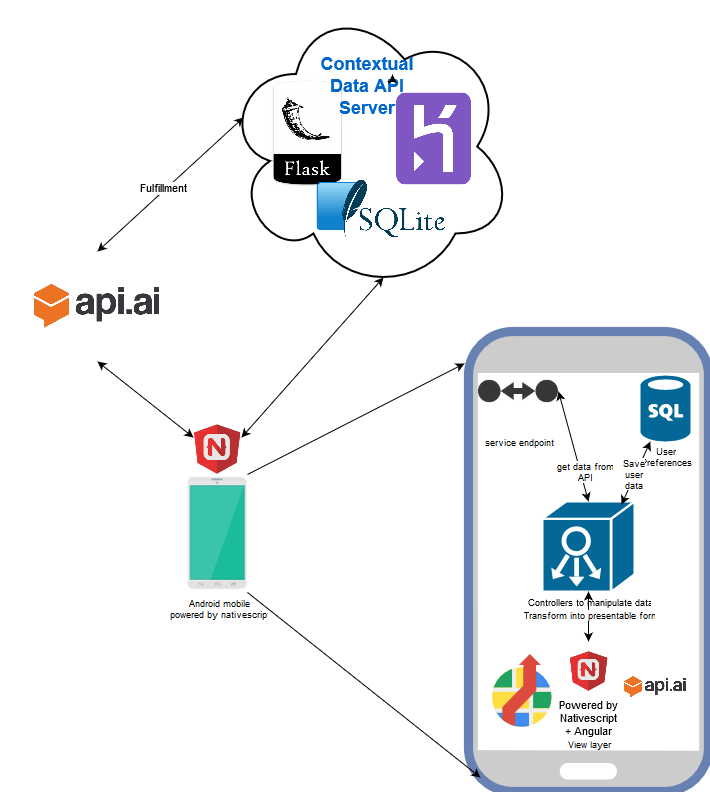

## Tech Nuances:
 - Native script + angular: Chose native script as I found that there is an Angular2 combination that would help me write less code by reusing whatever I have written in the web UI. However the View part if so different that Native script uses its own UI related tags that I had to rewrite that code by retaining the controller logics the same. It was not difficult as Angular2 is an MVC.
 - Build and Deploy was difficult during development as the node watch that tns uses is not effective that it does not effectively pick the file changes that are done. Had a bit of rough time with that.
 - Tabbed views were used to bring related information in a co-located views. But load all sub views without routing made all component load at the same time leading to some simultaneous network calls and UI load latency.
 - Routing with tns modules were so smooth and easy to code. Transferring complex object across activities were easy with JSON notations and JS engine.
 - Native script google maps support was readily available as add-on from as the native script developer community is active and has a lot of plugin support. Also the indoor maps view support were easily available and were enabled. But the plugins did not support directions and navigation.
 - Custom pull request to api-ai-javascript was given to retain user contexts. As we know that this project is contextual and data is relevant to the user who has logged in the fulfillment data need some context from UI to know who is the user who is actually conversing with API.ai. The raw REST client of api.ai has contexts but were not included in their javascript client sdk. I have written a small snippet to support it and is ready to get merged as a pull request.
 - Custom service to load google-maps-indoor direction were created by us as the native script google maps plugin did not support it owing to the factor that they are 2 different APIs and new keys should be added. However the plugin let us add routes with the help of polyline so that we wrote a sperate data service to map the route api calls and add polyline as routes for our indoor maps. This was one of the few greatest achievement as a developer in this project.

## Major User Flows:
&nbsp;&nbsp;&nbsp;&nbsp;&nbsp; There are 3 major flows in this app
**Admin and Session:** where we can login or add users, locations, campus, events and announcements. These views are generally used to feed data in to the system and manage them. The contextual backend is just an API backend and these views lets us manage all the data.
**Chatbot:** Essential crux of this app is the chat bot where the authenticated user interacts with the api.ai server and it gets fulfilled for some of the intents by the contextual backend we have created.
**Maps:** Indoor navigation is the essential concept behind this project. It is deeply tied between the contextual backend as it holds the relevant data. The Mazemap library is used for indoor maps and navigation.

### Home

### Announcements
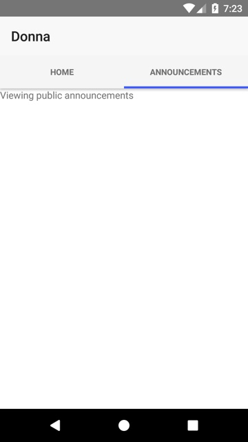
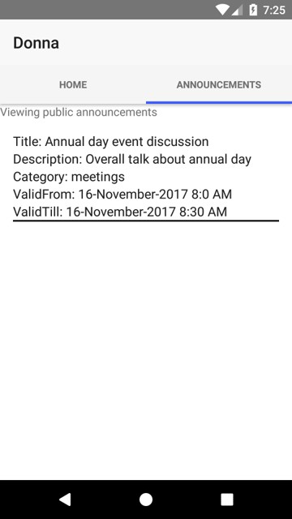

### User Login
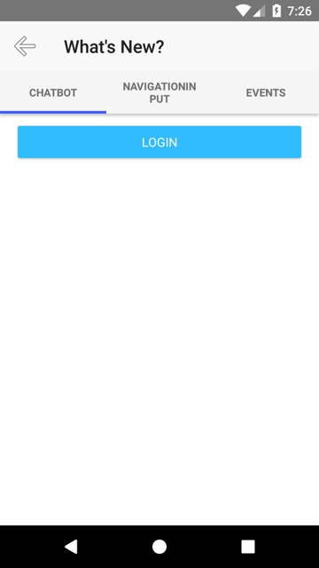
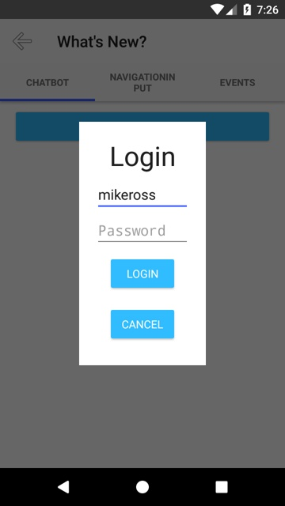

### ChatBot:
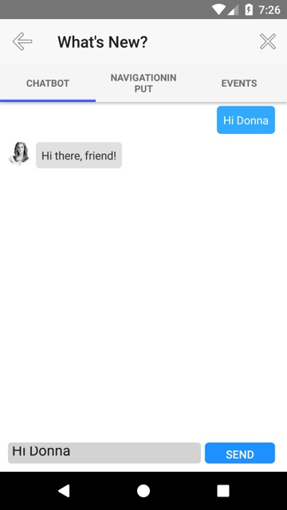
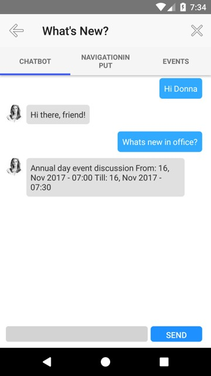
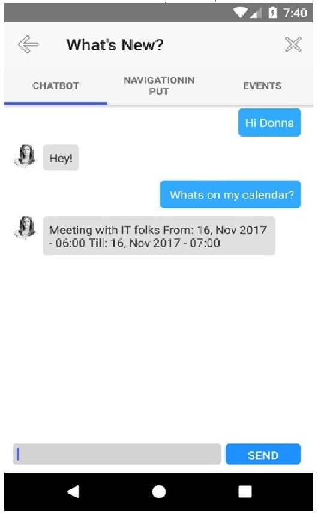
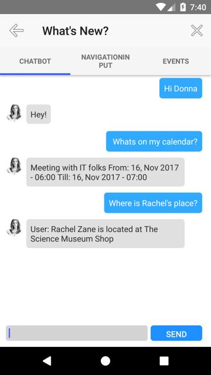
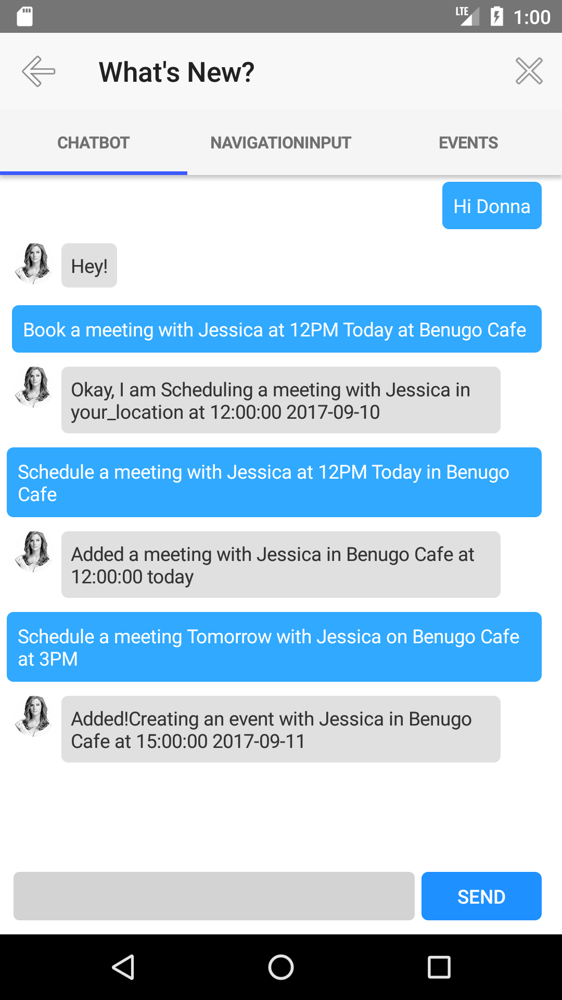
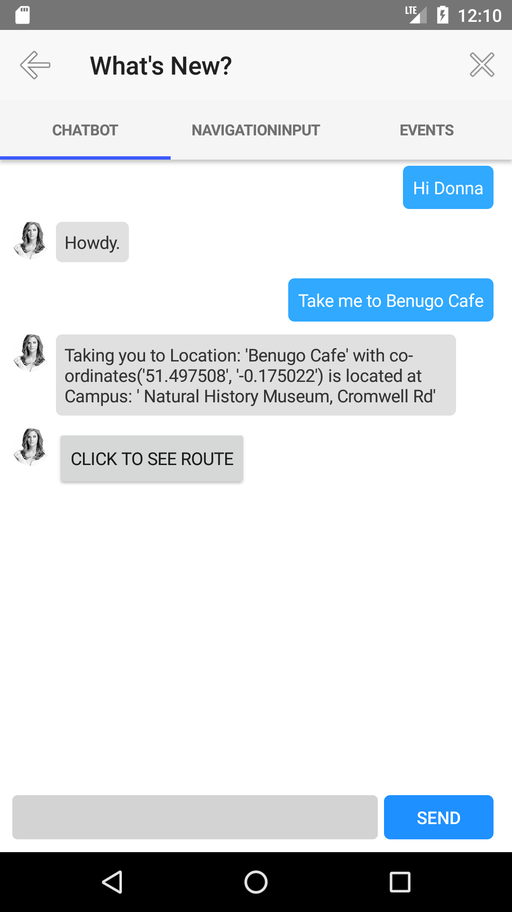

### Events:
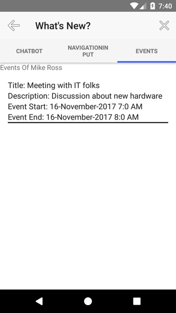
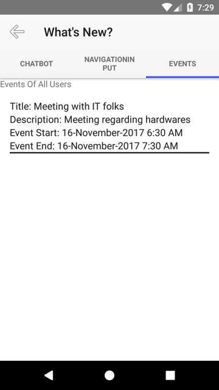

### Maps:
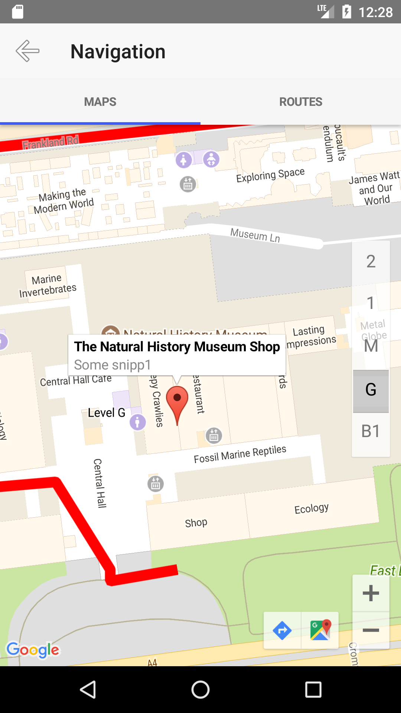
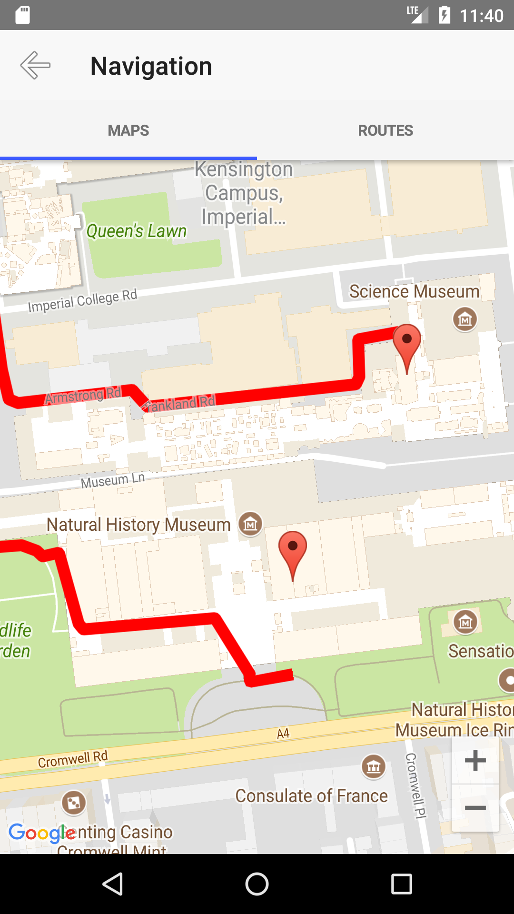
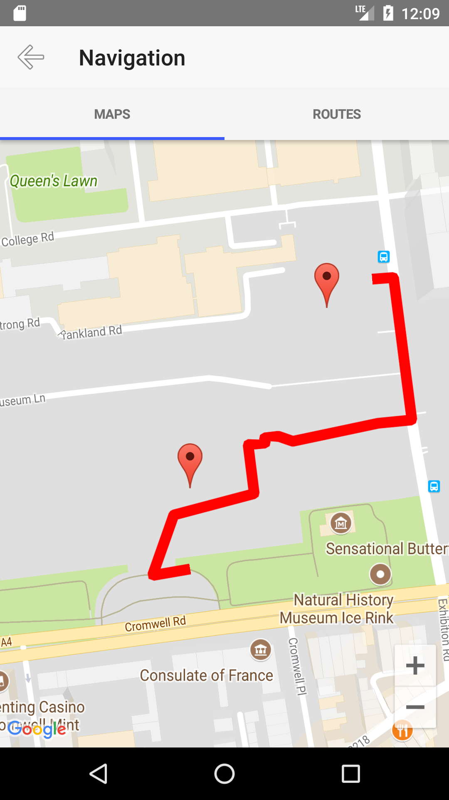
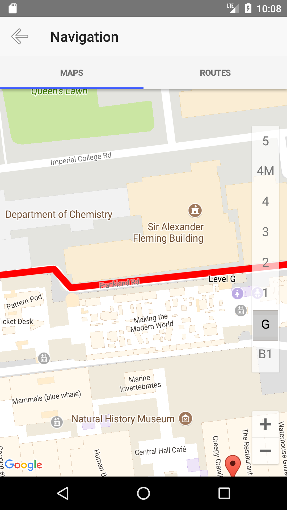
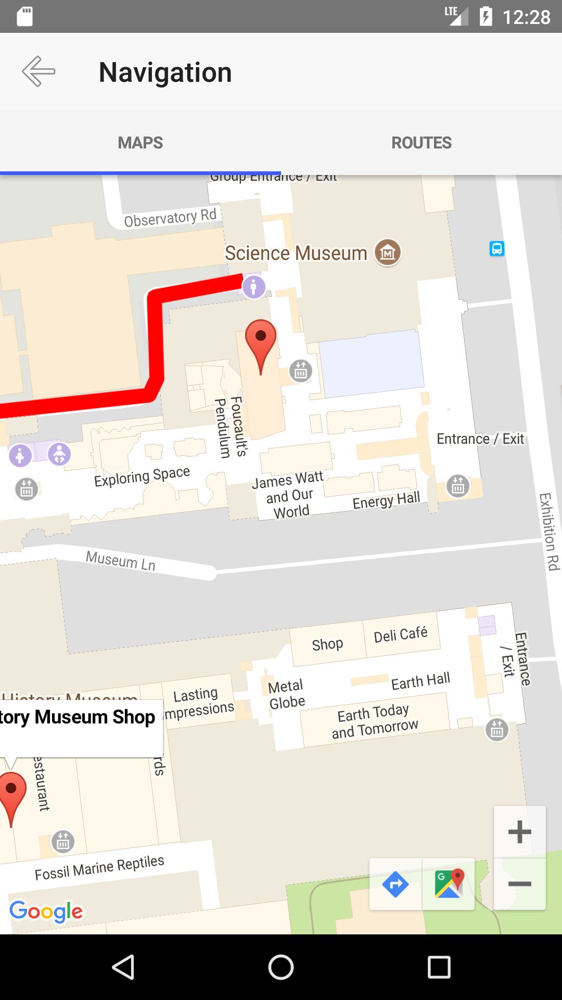
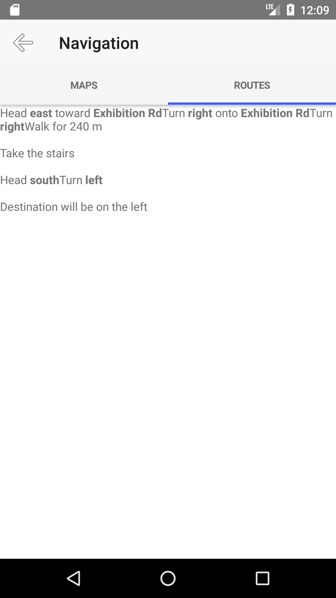

### Shortlisted submission
- This submission has been shortlisted as top 15 entries to be presented in The Old Trafford Stadium @ Manchester City
- Team SubtleStorms: https://www.hackerearth.com/challenges/hackathon/unitedbyhcl/dashboard/87c3351/team/
- Top 15 teams link : https://docs.google.com/spreadsheets/d/1Z-OEfrTSBGy-De-Rjk6MJf12p5gZYKEcFypydzpQkBY/edit#gid=0
- Demo of video demo: https://www.youtube.com/watch?v=gfLHhX8GDWA

## References:
- http://docs.nativescript.org/angular/start/quick-setup
- http://docs.nativescript.org/angular/tutorial/ng-chapter-1
- https://www.nativescript.org/blog/create-a-realtime-chat-interface-with-firebase-and-angular
- https://www.thepolyglotdeveloper.com/2016/10/navigating-nativescript-app-angular-2-router/
- http://docs.telerik.com/devtools/nativescript-ui/Controls/Angular/ListView/How-To/separators
- https://www.thepolyglotdeveloper.com/2017/07/simple-login-registration-nativescript-angular-mobile-app/
- https://docs.nativescript.org/core-concepts/angular-navigation
- https://github.com/dapriett/nativescript-google-maps-sdk
- http://android.wekeepcoding.com/article/11045549/Nativescript+Indoor+Ground+Map
- https://developers.google.com/maps/documentation/android-api/controls
- https://github.com/dapriett/nativescript-google-maps-sdk/blob/master/map-view-common.ts
